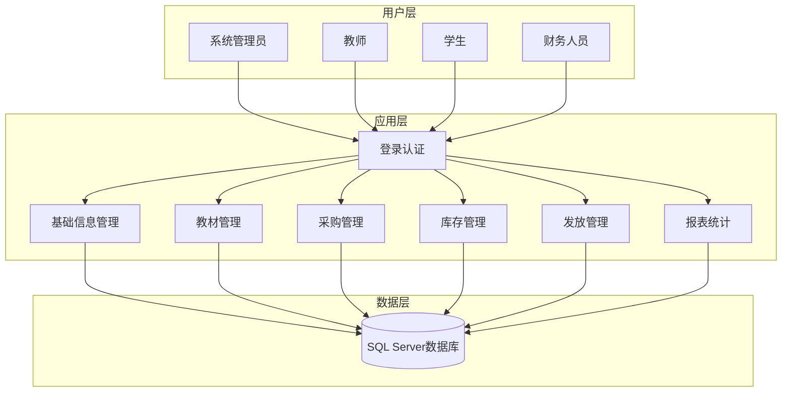
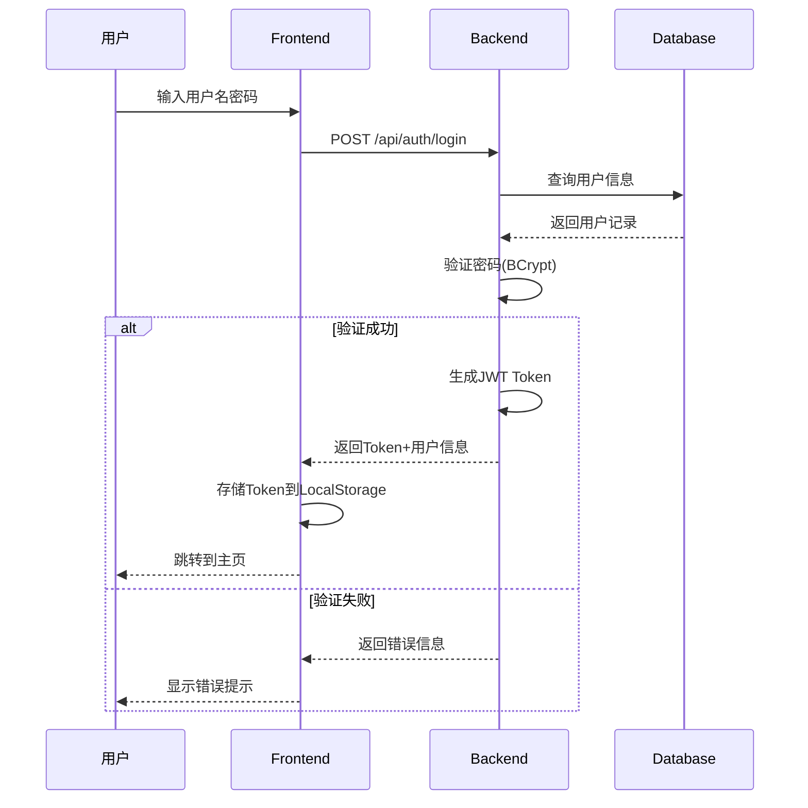
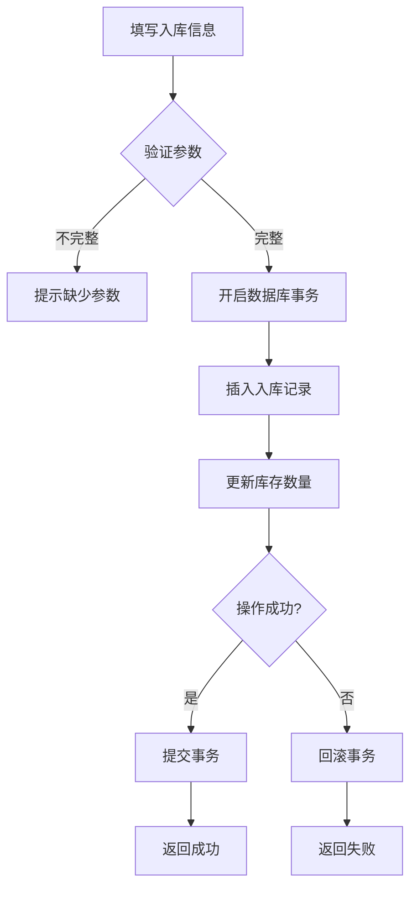

# 高校教材管理系统 - PPT演示内容

---

## 幻灯片1：封面页

**标题**：高校教材管理系统  
**副标题**：基于Vue 3 + Node.js的B/S架构解决方案  
**姓名**：[您的姓名]  
**日期**：2026年6月  

---

## 幻灯片2：背景介绍

### 1.1 项目背景

随着高等教育规模的不断扩大，高校教材管理工作面临着越来越多的挑战：
- 传统手工管理效率低下、容易出错
- 教材流转环节多，难以追溯
- 数据统计困难，决策缺乏依据

### 1.2 开发目标

本系统旨在实现：
- ✅ 教材全生命周期数字化管理
- ✅ 多角色权限管控，确保数据安全
- ✅ 丰富的统计报表功能，辅助决策
- ✅ 优化用户体验，提高管理效率

### 1.3 技术选型

| 分类 | 技术 | 版本 |
|------|------|------|
| 前端框架 | Vue | 3.4.0 |
| 构建工具 | Vite | 5.4.21 |
| UI组件 | Element Plus | 2.13.6 |
| 后端框架 | Express | 4.18.2 |
| 数据库 | SQL Server | 2024 |
| 认证方式 | JWT | - |

---

## 幻灯片3：总体设计

### 2.1 系统架构

采用经典三层架构：

```
┌─────────────────────────────────────────────────────────────┐
│                    前端展示层                               │
│          Vue 3 + Element Plus + Vite                       │
├─────────────────────────────────────────────────────────────┤
│                    API接口层                                │
│                    Express 4.x                             │
├─────────────────────────────────────────────────────────────┤
│                    数据访问层                               │
│                  SQL Server 2024                           │
└─────────────────────────────────────────────────────────────┘
```

### 2.2 模块划分

本系统可分为9个核心模块：

| 序号 | 模块名称 | 功能说明 |
|------|----------|----------|
| 1 | 基础信息管理 | 院系、专业、班级管理 |
| 2 | 教材信息管理 | 教材录入、查询、维护 |
| 3 | 教材选用与征订 | 选用申请、征订计划 |
| 4 | 采购与供应商管理 | 采购单、供应商管理 |
| 5 | 教材库存管理 | 入库、出库、盘点 |
| 6 | 教材发放管理 | 发放清单、发放记录 |
| 7 | 教材费收费与结算 | 费用核算、收费管理 |
| 8 | 查询与统计报表 | 各类统计报表 |
| 9 | 系统管理 | 用户、角色管理 |

---

## 幻灯片4：系统总体框图

### 3.1 系统架构图



### 3.2 用户登录流程图



### 3.3 教材入库流程图



---

## 幻灯片5：详细设计

### 4.1 数据库设计

**核心数据表结构：**

| 表名 | 说明 | 核心字段 |
|------|------|----------|
| Users | 用户表 | UserID, Username, Password, Name, RoleID |
| Books | 教材表 | BookID, BookName, ISBN, Author, Price |
| Inventory | 库存表 | InventoryID, BookID, WarehouseID, Quantity |
| PurchaseOrders | 采购单表 | OrderID, SupplierID, BookID, Quantity, Status |
| DistributionRecords | 发放记录表 | RecordID, StudentID, BookID, Quantity |

### 4.2 核心代码示例

**用户认证 - 登录验证：**
```javascript
// 文件: backend/controllers/auth.js
exports.login = async (req, res) => {
  const { username, password } = req.body;
  // 1. 查询用户
  // 2. 验证密码(BCrypt)
  // 3. 生成JWT Token
  // 4. 返回响应
};
```

**库存管理 - 入库处理：**
```javascript
// 文件: backend/controllers/inventory.js
exports.addInbound = async (req, res) => {
  // 1. 参数验证
  // 2. 开启事务
  // 3. 插入入库记录
  // 4. 更新库存
  // 5. 提交/回滚事务
};
```

### 4.3 界面设计

**设计原则：**
- 灰白色高级配色方案
- 响应式布局设计
- 统一的设计语言和交互风格

**界面组成：**
- 登录页面：表单+卡通装饰
- 主页面：侧边栏导航 + 顶部导航 + 主内容区

---

## 幻灯片6-8：相关图片

### 截图1：登录界面


**界面特点：**
- 左侧卡通小猫跟随鼠标移动
- 灰白色配色方案
- 简洁现代的表单设计

### 截图2：系统主界面


**界面特点：**
- 侧边栏导航菜单
- 顶部通知和用户信息
- 统计数据卡片展示

### 截图3：教材管理页面


**功能特点：**
- 多条件搜索
- 分页展示
- 新增/编辑/删除操作

### 截图4：统计报表页面


**功能特点：**
- 多种统计维度
- 数据可视化展示
- 数据导出功能

---

## 幻灯片9：结论

### 5.1 项目总结

✅ **已完成功能：**
1. 基础信息管理（院系、专业、班级）
2. 教材信息管理（录入、查询、维护）
3. 教材选用与征订（选用申请、征订计划）
4. 采购与供应商管理（采购单、供应商）
5. 库存管理（入库、出库、盘点）
6. 发放管理（发放清单、记录）
7. 费用管理（核算、结算）
8. 报表统计（各类统计报表）
9. 系统管理（用户、角色）

### 5.2 技术亮点

- **前后端分离**：Vue 3 + Node.js 架构
- **JWT认证**：安全的身份验证机制
- **响应式设计**：适配不同设备
- **代码规范**：清晰的目录结构

### 5.3 后续优化方向

- ⬜ 增加移动端适配
- ⬜ 引入图表可视化组件
- ⬜ 添加消息推送功能
- ⬜ 优化大数据量下的性能

---

## 附录：系统访问方式

- **前端地址**：http://localhost:5173
- **后端地址**：http://localhost:3000
- **测试账号**：用户名 `wyb` / 密码 `wyb666`