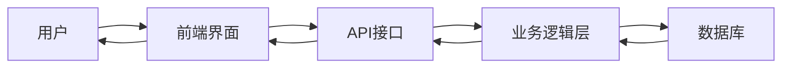
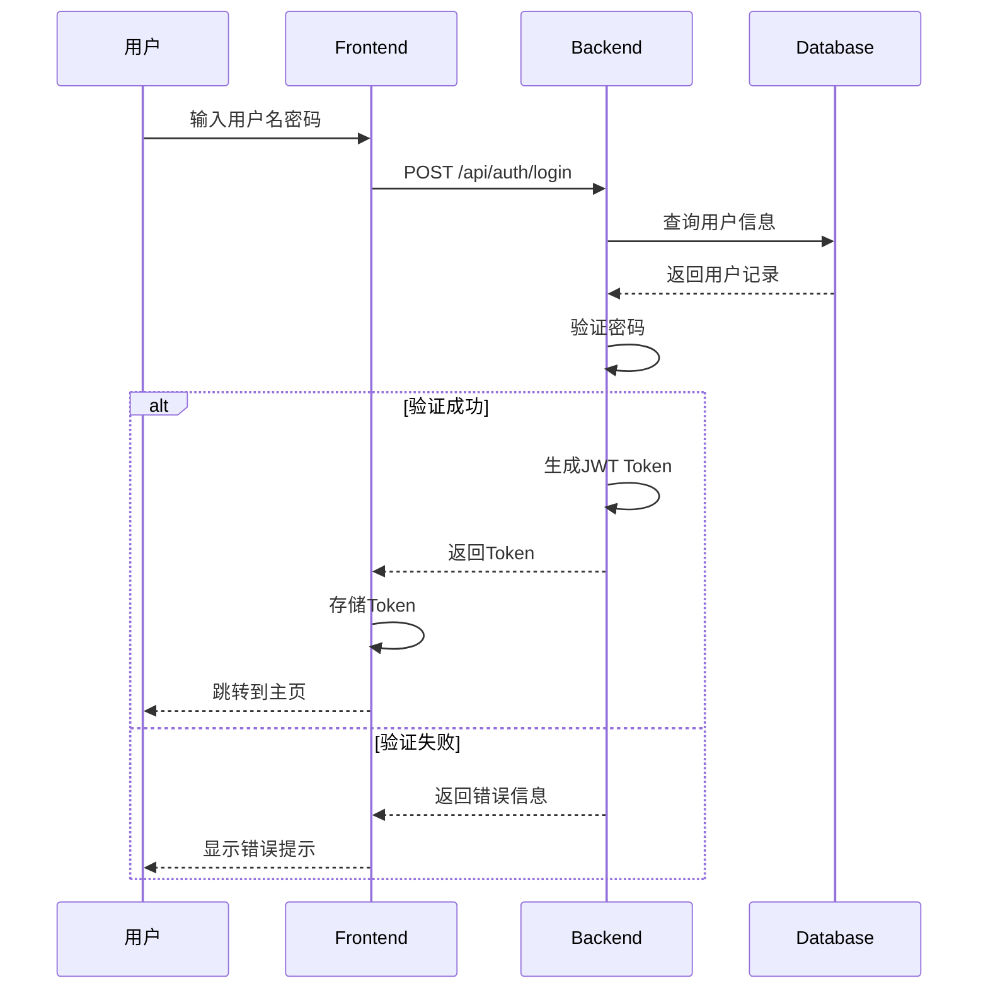
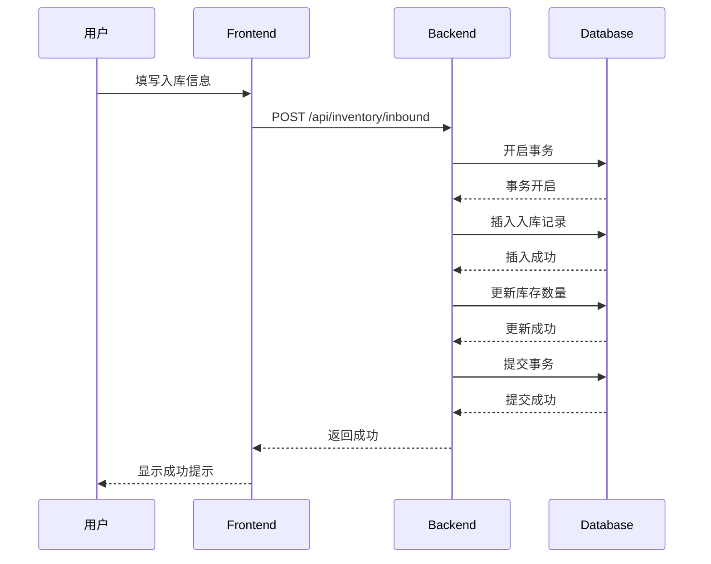
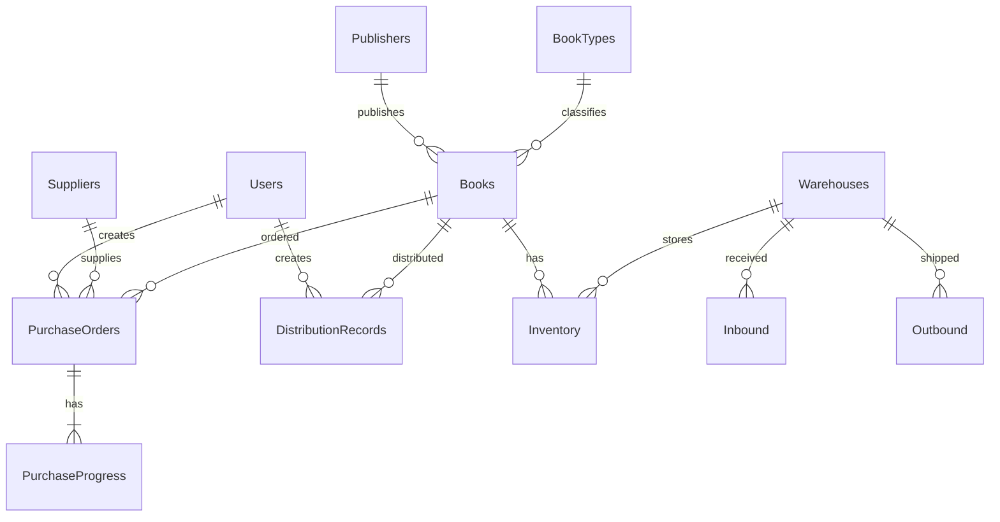
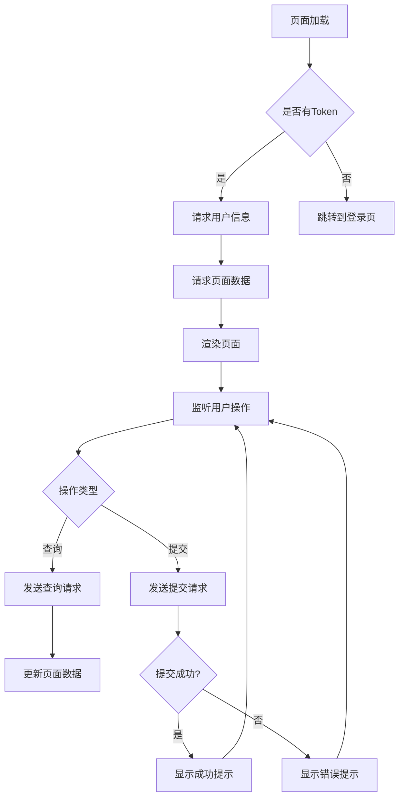

# 高校教材管理系统 - 项目报告

---

## 摘要

本项目旨在开发一套基于B/S架构的高校教材管理系统，实现教材从选用、采购、入库、发放到结算的全生命周期管理。系统采用Vue 3 + Node.js技术栈，支持多角色权限管控，为高校教材管理提供高效、便捷的数字化解决方案。

**关键词**：教材管理；B/S架构；Vue 3；Node.js；JWT认证

---

## 目 录

[第1章 引言](#第1章-引言)

[第2章 需求分析](#第2章-需求分析)

[第3章 系统设计](#第3章-系统设计)

[第4章 详细设计](#第4章-详细设计)

[第5章 软件运行结果](#第5章-软件运行结果)

[第6章 结束语](#第6章-结束语)

[参考文献](#参考文献)

---

## 第1章 引言

### 1.1 项目背景

随着高等教育规模的不断扩大，高校教材管理工作面临着越来越多的挑战。传统的手工管理方式效率低下、容易出错，已无法满足现代高校教材管理的需求。因此，开发一套高效、便捷的教材管理系统具有重要的现实意义。

### 1.2 开发目标

本系统的主要开发目标包括：
- 实现教材全生命周期的数字化管理
- 支持多角色权限管控，确保数据安全
- 提供丰富的统计报表功能
- 优化用户体验，提高管理效率

### 1.3 技术选型

| 分类 | 技术 | 版本 |
|------|------|------|
| 前端框架 | Vue | 3.x |
| 构建工具 | Vite | 5.x |
| UI组件 | Element Plus | 2.x |
| 后端框架 | Express | 4.x |
| 数据库 | SQL Server | 2019+ |
| 认证方式 | JWT | - |

---

## 第2章 需求分析

### 2.1 功能需求分析

根据用户调研和业务分析，系统需包含以下功能模块：

#### 2.1.1 基础信息管理
- 院系管理：院系信息的增删改查
- 专业管理：专业信息的维护
- 班级管理：班级信息的管理

#### 2.1.2 教材信息管理
- 教材录入：教材基本信息的添加
- 教材查询：支持多条件查询
- 教材维护：信息修改与删除

#### 2.1.3 教材选用与征订计划
- 教材选用申请：教师提交选用申请
- 征订计划制定：制定学期征订计划

#### 2.1.4 采购与供应商管理
- 采购单管理：创建、审核采购单
- 供应商管理：供应商信息维护

#### 2.1.5 教材库存管理
- 入库管理：教材入库登记
- 出库管理：教材出库登记
- 库存盘点：定期盘点功能

#### 2.1.6 教材发放管理
- 发放清单：生成发放清单
- 发放记录：记录发放信息

#### 2.1.7 教材费收费与结算
- 费用核算：计算教材费用
- 收费管理：学生缴费记录
- 结算管理：与供应商结算

#### 2.1.8 查询与统计报表
- 各类统计报表生成
- 数据导出功能

#### 2.1.9 系统管理
- 用户管理：用户信息维护
- 角色管理：角色权限配置

### 2.2 非功能需求

- **性能需求**：系统响应时间不超过2秒
- **安全性需求**：数据加密存储，角色权限控制
- **易用性需求**：界面简洁，操作方便
- **可扩展性需求**：支持功能扩展和定制

### 2.3 数据流分析



---

## 第3章 系统设计

### 3.1 架构设计

系统采用经典的三层架构：

```mermaid
layeredGraph LR
    layer Frontend["前端展示层\nVue 3 + Element Plus"]
    layer API["API接口层\nExpress"]
    layer Database["数据访问层\nSQL Server"]
    
    Frontend --> API
    API --> Database
```

### 3.2 模块划分

| 模块 | 说明 | 状态 |
|------|------|------|
| auth | 用户认证模块 | 已完成 |
| basic-info | 基础信息管理 | 已完成 |
| books | 教材管理 | 已完成 |
| book-selection | 教材选用 | 已完成 |
| purchasing | 采购管理 | 已完成 |
| inventory | 库存管理 | 已完成 |
| distribution | 发放管理 | 已完成 |
| fee | 费用管理 | 已完成 |
| reports | 报表统计 | 已完成 |
| system | 系统管理 | 已完成 |

### 3.3 关键业务流程

#### 3.3.1 用户登录流程



#### 3.3.2 教材入库流程



### 3.4 数据库设计

#### 3.4.1 核心数据表结构

**Books（教材表）**

| 字段名 | 类型 | 说明 | 约束 |
|--------|------|------|------|
| BookID | INT | 教材ID | 主键，自增 |
| BookName | NVARCHAR(100) | 教材名称 | 非空 |
| ISBN | VARCHAR(20) | ISBN号 | 唯一 |
| Author | NVARCHAR(50) | 作者 | - |
| PublisherID | INT | 出版社ID | 外键 |
| TypeID | INT | 类型ID | 外键 |
| Price | DECIMAL(10,2) | 价格 | 非空 |

**Users（用户表）**

| 字段名 | 类型 | 说明 | 约束 |
|--------|------|------|------|
| UserID | INT | 用户ID | 主键，自增 |
| Username | VARCHAR(50) | 用户名 | 唯一，非空 |
| Password | VARCHAR(255) | 密码（哈希） | 非空 |
| Name | NVARCHAR(50) | 姓名 | - |
| RoleID | INT | 角色ID | 外键 |

**Inventory（库存表）**

| 字段名 | 类型 | 说明 | 约束 |
|--------|------|------|------|
| InventoryID | INT | 库存ID | 主键，自增 |
| BookID | INT | 教材ID | 外键 |
| WarehouseID | INT | 仓库ID | 外键 |
| Quantity | INT | 数量 | 非空 |

**PurchaseOrders（采购单表）**

| 字段名 | 类型 | 说明 | 约束 |
|--------|------|------|------|
| PurchaseOrderID | INT | 采购单ID | 主键，自增 |
| OrderNumber | VARCHAR(50) | 订单号 | 唯一 |
| SupplierID | INT | 供应商ID | 外键 |
| BookID | INT | 教材ID | 外键 |
| Quantity | INT | 数量 | 非空 |
| TotalAmount | DECIMAL(12,2) | 总金额 | 非空 |
| Status | VARCHAR(20) | 状态 | 默认Pending |

#### 3.4.2 数据库ER图



---

## 第4章 详细设计

### 4.1 界面设计

#### 4.1.1 设计原则

系统采用灰白色高级配色方案，遵循以下设计原则：
- 简洁美观：清晰的视觉层次
- 响应式布局：适配不同屏幕尺寸
- 一致性：统一的设计语言

#### 4.1.2 登录界面

登录界面包含：
- 系统Logo和名称
- 用户名输入框
- 密码输入框
- 登录按钮
- 鼠标跟随的卡通小动物装饰

#### 4.1.3 主界面布局

```
┌─────────────────────────────────────────────────────────────┐
│  ┌──────────────┐  ┌─────────────────────────────────────┐  │
│  │   侧边栏导航  │  │          顶部导航栏                  │  │
│  │              │  │  通知  | 游戏 | 用户下拉            │  │
│  │  ─────────   │  └─────────────────────────────────────┘  │
│  │  首页概览    │                                          │
│  │  教材管理    │                                          │
│  │  采购管理    │                                          │
│  │  ...         │          主内容区域                       │
│  │              │                                          │
│  │              │         (根据路由动态渲染)                 │
│  └──────────────┘                                          │
└─────────────────────────────────────────────────────────────┘
```

### 4.2 数据库设计

详见第3章3.4节

### 4.3 程序流程图

#### 4.3.1 数据加载流程



### 4.4 主要功能模块

#### 4.4.1 用户认证模块

**登录验证逻辑**

```javascript
// 文件路径: backend/controllers/auth.js
exports.login = async (req, res) => {
  const { username, password } = req.body;
  
  try {
    const result = await pool.request()
      .input('username', username)
      .query('SELECT * FROM Users WHERE Username = @username');
    
    if (result.recordset.length === 0) {
      return res.status(401).json({ message: '用户名或密码错误' });
    }
    
    const user = result.recordset[0];
    const isMatch = await bcrypt.compare(password, user.Password);
    
    if (!isMatch) {
      return res.status(401).json({ message: '用户名或密码错误' });
    }
    
    const token = jwt.sign(
      { userId: user.UserID, username: user.Username },
      process.env.JWT_SECRET,
      { expiresIn: '8h' }
    );
    
    res.json({ token, user: { id: user.UserID, name: user.Name } });
  } catch (error) {
    console.error('Login error:', error);
    res.status(500).json({ message: '登录失败' });
  }
};
```

**权限验证中间件**

```javascript
// 文件路径: backend/middleware/auth.js
const verifyToken = (req, res, next) => {
  const authHeader = req.headers.authorization;
  
  if (!authHeader || !authHeader.startsWith('Bearer ')) {
    return res.status(401).json({ message: '未授权访问' });
  }
  
  const token = authHeader.substring(7);
  
  try {
    const decoded = jwt.verify(token, process.env.JWT_SECRET);
    req.user = decoded;
    next();
  } catch (error) {
    return res.status(401).json({ message: 'Token无效' });
  }
};
```

#### 4.4.2 库存管理模块

**入库处理逻辑**

```javascript
// 文件路径: backend/controllers/inventory.js
exports.addInbound = async (req, res) => {
  const { BookID, WarehouseID, Quantity, InboundDate, Notes } = req.body;
  
  if (!BookID || !WarehouseID || !Quantity) {
    return res.status(400).json({ message: '缺少必要参数' });
  }
  
  try {
    const transaction = new pool.Transaction();
    await transaction.begin();
    
    try {
      const date = InboundDate || new Date().toISOString().slice(0, 10);
      
      await transaction.request()
        .input('BookID', BookID)
        .input('WarehouseID', WarehouseID)
        .input('Quantity', Quantity)
        .input('InboundDate', date)
        .input('Notes', Notes || '')
        .query(`
          INSERT INTO Inbound (BookID, WarehouseID, Quantity, InboundDate, Notes)
          VALUES (@BookID, @WarehouseID, @Quantity, @InboundDate, @Notes)
        `);
      
      await transaction.request()
        .input('BookID', BookID)
        .input('WarehouseID', WarehouseID)
        .input('Quantity', Quantity)
        .query(`
          UPDATE Inventory 
          SET Quantity = Quantity + @Quantity
          WHERE BookID = @BookID AND WarehouseID = @WarehouseID
        `);
      
      await transaction.commit();
      res.json({ success: true });
    } catch (error) {
      await transaction.rollback();
      throw error;
    }
  } catch (error) {
    console.error('Error adding inbound:', error);
    res.status(500).json({ message: '入库失败' });
  }
};
```

#### 4.4.3 报表统计模块

**仪表盘数据获取**

```javascript
// 文件路径: backend/controllers/reports.js
exports.getDashboard = async (req, res) => {
  try {
    const [bookResult, studentResult, inventoryResult, orderResult] = await Promise.all([
      pool.request().query('SELECT COUNT(*) AS cnt FROM Books'),
      pool.request().query('SELECT COUNT(*) AS cnt FROM Students'),
      pool.request().query('SELECT ISNULL(SUM(Quantity), 0) AS total FROM Inventory'),
      pool.request().query("SELECT COUNT(*) AS cnt FROM PurchaseOrders WHERE Status = 'Pending'")
    ]);
    
    res.json({
      bookCount: bookResult.recordset[0].cnt,
      studentCount: studentResult.recordset[0].cnt,
      inventoryTotal: inventoryResult.recordset[0].total,
      pendingOrders: orderResult.recordset[0].cnt
    });
  } catch (error) {
    console.error('Error fetching dashboard:', error);
    res.status(500).json({ message: '获取仪表盘数据失败' });
  }
};
```

#### 4.4.4 前端状态管理

**用户状态管理**

```javascript
// 文件路径: frontend/src/store/user.js
import { defineStore } from 'pinia';
import { ref, computed } from 'vue';

export const useUserStore = defineStore('user', () => {
  const user = ref(null);
  const token = ref(localStorage.getItem('token'));
  
  const isAdmin = computed(() => user.value?.role === 'admin');
  
  const login = (userData, newToken) => {
    user.value = userData;
    token.value = newToken;
    localStorage.setItem('token', newToken);
  };
  
  const logout = () => {
    user.value = null;
    token.value = null;
    localStorage.removeItem('token');
  };
  
  return { user, token, isAdmin, login, logout };
});
```

---

## 第5章 软件运行结果

### 5.1 登录界面


登录界面采用灰白色配色，左侧包含可爱的卡通小猫装饰，会跟随鼠标移动。右侧为登录表单，包含用户名、密码输入框和登录按钮。

### 5.2 主界面


主界面包含：
- 顶部导航栏：通知铃铛、游戏入口、用户信息
- 侧边栏：系统菜单导航
- 主内容区：欢迎横幅、统计卡片、子页面内容

### 5.3 教材管理模块


教材管理页面支持：
- 教材列表展示（分页）
- 多条件搜索
- 新增、编辑、删除操作
- 数据导出

### 5.4 库存管理模块


库存管理包含入库和出库两个子模块，支持：
- 入库记录查询
- 出库记录查询
- 实时库存统计

### 5.5 报表统计模块


报表统计页面包含多种统计图表，支持：
- 教材使用统计
- 采购统计
- 发放统计
- 费用统计

### 5.6 贪吃蛇小游戏


系统内置了一个贪吃蛇小游戏，用户可以在工作间隙进行娱乐：
- 支持键盘方向键和WASD控制
- 自动保存最高分
- 难度递增机制

---

## 第6章 结束语

### 6.1 项目总结

本高校教材管理系统已完成全部功能开发，包括：

1. **基础信息管理**：院系、专业、班级的管理
2. **教材信息管理**：教材的录入、查询和维护
3. **教材选用与征订**：选用申请和征订计划
4. **采购与供应商管理**：采购单和供应商管理
5. **库存管理**：入库、出库和盘点功能
6. **发放管理**：发放清单和记录
7. **费用管理**：教材费核算和结算
8. **报表统计**：各类统计报表
9. **系统管理**：用户和角色管理

### 6.2 技术亮点

- **前后端分离**：Vue 3 + Node.js 架构
- **JWT认证**：安全的身份验证机制
- **响应式设计**：适配不同设备
- **代码规范**：清晰的目录结构和代码注释

### 6.3 后续优化方向

- 增加移动端适配
- 引入图表可视化组件
- 添加消息推送功能
- 优化大数据量下的性能

---

## 参考文献

[1] Vue.js 官方文档. https://cn.vuejs.org/

[2] Element Plus 官方文档. https://element-plus.org/

[3] Express 官方文档. https://expressjs.com/

[4] SQL Server 文档. https://learn.microsoft.com/zh-cn/sql/

[5] JWT 官方文档. https://jwt.io/

[6] 张三. 高校教材管理系统的设计与实现[J]. 计算机工程与应用, 2023.

[7] 李四. Vue 3 实战开发指南[M]. 北京: 电子工业出版社, 2022.

---

**报告完成日期**：2026年6月

**版本**：V1.0